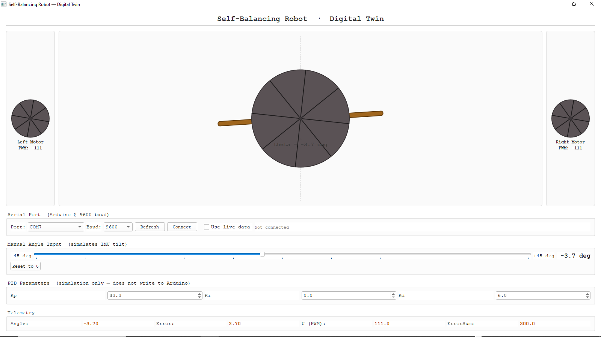

# Self-Balancing Robot Digital Twin

After building and tuning my self-balancing robot, I wanted to go beyond what I could observe physically. So I built this tool. It connects to the Arduino over serial and animates the system behaviour in real time using the actual sensor data. What I saw in the animation corrected some of what I thought I had observed physically. I will be writing a full article on that experience soon.

This is the companion tool to the [Self-Balancing Robot PID Control](https://github.com/i-am-the-robot/Self-Balancing-Robot-PID) project.




---

## What It Does

The tool has two modes.

In live serial mode, it connects directly to the Arduino over USB and animates the actual tilt angle, wheel speed, and PWM output in real time as the physical robot runs. This is the mode I used to validate my results.

In simulation mode, it runs the PID equation in software using a slider to simulate the tilt angle. You can adjust the Kp, Ki, and Kd values and watch how the system responds without needing the physical hardware.

---

## Requirements

Make sure you have Python installed, then install the required libraries by running:

```
pip install PyQt5 pyserial
```

---

## How to Run It

```
python Self-balancing-Robot-Digital-Twin.py
```

---

## Connecting to the Arduino

Before switching to live serial mode, make sure your Arduino is running the self-balancing robot code and printing data to serial in this format:

```
Angle: X    Error: Y    U: Z
```

Then in the tool, select your COM port, set the baud rate to 9600, click Connect, and check the Use live data box. The animation will start responding to the real sensor data from your robot.

Note: The tool defaults to COM16. Change this to match your own port if it is different.

---

## Key Things to Note

Physical observation alone can mislead you. When the robot appears stable, the wheels are still moving. The digital twin made this visible in a way the physical robot hides from the eye.

The simulation mode is useful for understanding how each PID parameter affects the system before you start tuning on the hardware. It saves time.

If you want to use a different baud rate, change it in the baud rate dropdown before connecting.

---

## Related

Full write-up on the physical robot: [What Building a Self-Balancing Robot Taught Me After Many Days of Tuning](https://www.linkedin.com/in/salisutitilola123)

Physical robot code: [Self Balancing Robot PID Control](https://github.com/i-am-the-robot/Self-Balancing-Robot-PID)

---

*A dedicated article on what this tool revealed is coming soon. Watch out for that.*
